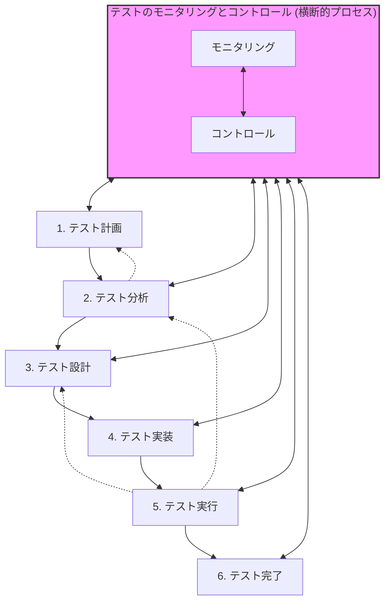

# JSTQBテストプロセスの関係性：解説資料

JSTQB Foundation Level シラバスで定義されている「7つのテストプロセス」は、それぞれが独立しているのではなく、密接に連携し、時には並行・反復して行われます。

## 1. 全体像とプロセス間の連携

テストプロセスは、逐次的な流れ（ウォーターフォール型）だけでなく、フィードバックによる反復的な性質も持っています。

### プロセス間の主な連携
- **順方向の連携**: 前工程で定義された基盤（テストベースやテスト条件）を、より詳細な成果物（テストケースやテスト手順）へと具体化していきます。
- **逆方向のフィードバック**: テスト実行中に発見された不具合や困難さから、テスト設計の不備やテスト計画の非現実性が明らかになり、前のプロセスへ戻って修正が必要になることがあります。

---

## 2. 成果物の活用とトレーサビリティ

各プロセスの成果物は、次のプロセスの「テストベース（根拠）」として活用されます。

| プロセス | 主な成果物 | 次プロセスでの活用方法 |
| :--- | :--- | :--- |
| **テスト計画** | テスト計画書 | テスト分析・設計の優先順位付け、リソース割り当ての基準となる。 |
| **テスト分析** | テスト条件 | 「何をテストするか」を定義し、テスト設計でのケース作成の元ネタになる。 |
| **テスト設計** | テストケース | テスト実装において、具体的なテストデータや手順を肉付けする基盤となる。 |
| **テスト実装** | テスト手順、テスト項目 | テスト実行で、テスターが実際に操作するための詳細なマニュアルとなる。 |
| **テスト実行** | テストログ、欠陥レポート | テスト完了において、終了基準の判定や完了レポート作成の根拠データとなる。 |
| **テスト完了** | テスト完了レポート | 将来のプロジェクトやメンテナンスフェーズでのナレッジとして活用される。 |

> [!IMPORTANT]
> **トレーサビリティの確保**  
> テストベースからテスト実行結果までを紐付けることで、「要件がすべてテストされたか」「発見された不具合がどの要件に影響するか」を追跡可能にします。

---

## 3. 「モニタリングとコントロール」の役割

このプロセスは他のプロセスと並行して常に行われる**「管理の要」**です。

### テストのモニタリング (Checking)
他のすべての各プロセスからデータを収集し、現在の進捗と計画との乖離を確認します。
- **活動内容**: テスト実行率、合格率、未解決の欠陥数などのメトリクスを収集・分析。
- **他プロセスとの関わり**: 各プロセスが順調か、出口基準（終了条件）を満たしているかを客観的に評価します。

### テストのコントロール (Action)
モニタリングによって得られた情報に基づき、計画を維持するため、あるいは最適化するために必要な是正処置を行います。
- **活動内容**: 優先順位の変更、リソースの追加投入、スケジュールの調整、テスト終了基準の緩和/厳格化。
- **他プロセスとの関わり**: 
  - **計画に対して**: コントロール活動の結果として、テスト計画の更新が必要になることが多い。
  - **設計・実装に対して**: 未発見の重大な欠陥が見つかった場合、その領域のテスト設計を深めるよう指示を出す。

---

## まとめ

JSTQBの7つのプロセスは、**「計画」**に基づいて**「分析・設計・実装・実行」**が具体化され、各段階での状況を**「モニタリングとコントロール」**が見守り、最後に**「完了」**で総括するという有機的なつながりを持っています。

この関係性を理解することで、単なる作業の羅列ではなく、品質を管理するためのシステムとしてテスト活動を捉えることができます。
